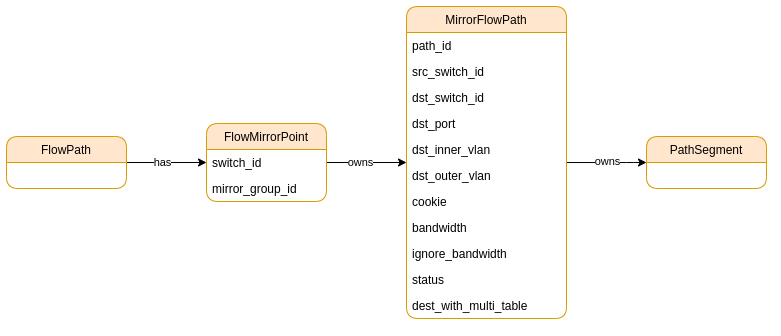
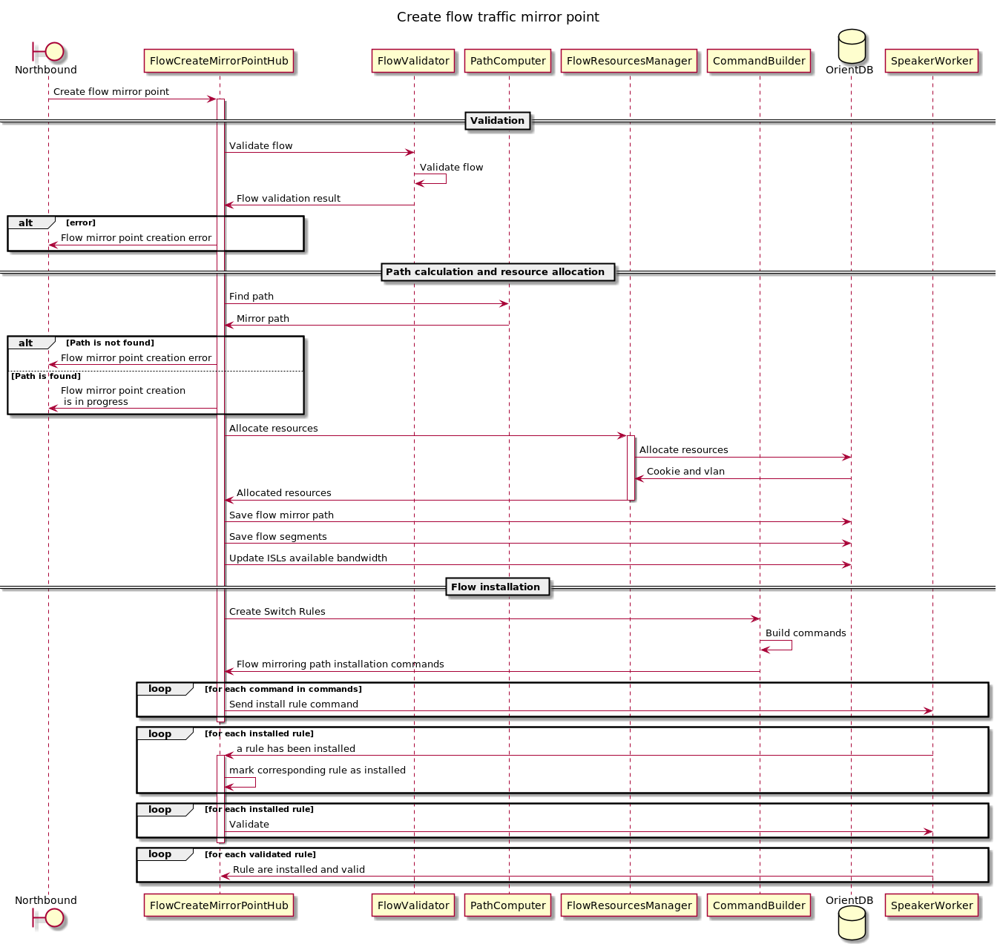
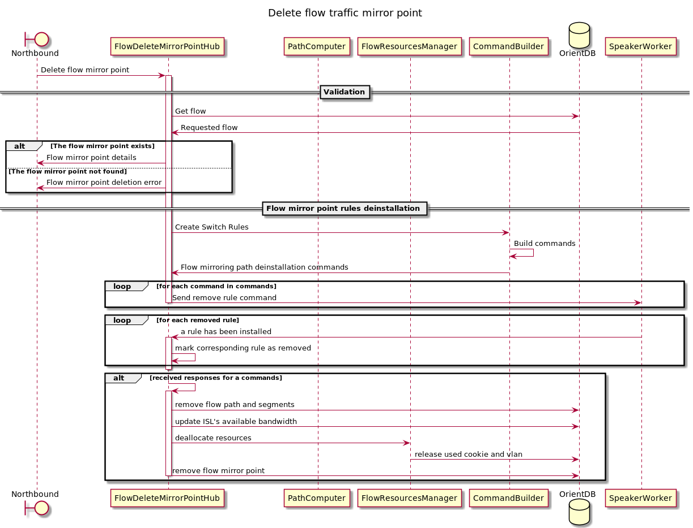
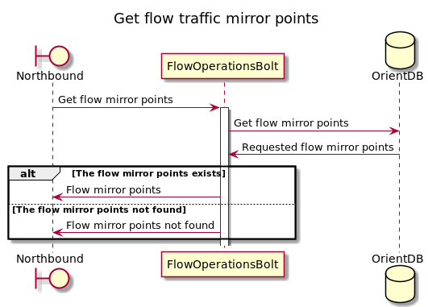

# Flow traffic mirroring

## Idea
There must be an ability to mirror traffic on a given flow and send it to a specific switch+port+vlan.

## Model
FlowPath has a list of FlowMirrorPoints, which will contain MirrorGroupId for multicasting on the switch. 
FlowMirrorPoint itself has a list of MirrorFlowPaths. MirrorFlowPaths contains the endpoint 
where the traffic should be mirrored and other necessary information to build the path.



If the receiver point is on the mirroring source switch, then no segments will be built for such a MirrorFlowPath, 
and we will work with it like the paths in one switch flow.

## API
* Create mirror point:
  
  `PUT /flows/{flow_id}/mirror`
  
  payload:
  ```
  {
      "flow_id": string,
      "mirror_point": switch_id,
      "mirror_direction": string [FORWARD|REVERSE],
      "receiver_point": {
         "switch_id": string,
         "port": int,
         "inner_vlan": int,
         "outer_vlan": int
      }
  }
  ```

* Delete mirror point:

  `DELETE /flows/{flow_id}/mirror`

  payload:
  ```
  {
      "flow_id": string,
      "mirror_point": switch_id,
      "mirror_direction": string [FORWARD|REVERSE],
      "receiver_point": {
          "switch_id": string,
          "port": int,
          "inner_vlan": int,
          "outer_vlan": int
      }
  }
  ```

* Get mirror points:

  `GET /flows/{flow_id}/mirror`

  Response payload:
  ```
  {
      "flow_id": string,
      "points":[
          {
              "mirror_point": switch_id,
              "mirror_direction": string [FORWARD|REVERSE],
              "receiver_point": {
                  "switch_id": string,
                  "port": int,
                  "inner_vlan": int,
                  "outer_vlan": int
              }
          }
      ]
  }
  ```


* API that needs to be updated: 
  - Need to add information about the state of the mirror paths in the flow payload.
  - It is necessary to add information about built mirror paths to API `GET /flows/{flow_id}/path`

## Workflow

Creation and deletion flow mirror points in the FlowHSTopology:




Getting flow mirror points in the NbWorkerTopology:



## Affected kilda components
* need to add mirror groups to the Floodlight;
* need to update RerouteTopology to react to the network events for the mirror paths;
* add logic to the flow update operation when updating flow endpoints;
* update switch and flow validation.

## Limitations
It is allowed to use a transit switch as a mirror point only if flow is pinned.

## Related issues
There are currently no asymmetric bandwidth ISLs in the system. This feature sets paths in one direction only. 
This results in asymmetric ISLs appearing in the system. This effect on the system requires more in-depth research.

## Switch rules
Examples of rules for VLAN transit encapsulation:
* _Group_:
```
{
   "dpid": dpid,
   "type": "ALL",
   "group_id": GROUP_ID,
   "buckets":[
      {
         "actions":[
            {
               "type": "SET_FIELD", 
               "field": "vlan_vid",
               "value": vid
            },
            {
               "type": "OUTPUT",
               "port": first_out_port
            }
         ]
      },
      {
         "actions":[
            {
               "type": "SET_FIELD", 
               "field": "vlan_vid",
               "value": vid
            },
            {
               "type": "OUTPUT",
               "port": second_out_port
            }
         ]
      }
   ]
}
```
* _Mirror rule_ for egress rule:
```
{
   "dpid": dpid,
   "cookie": MIRROR_FLOW_COOKIE,
   "table_id": EGRESS_TABLE_ID,
   "priority": priority,
   "match":{
      "in_port": in_port,
      "vlan_vid": transit_vid
   },
   "actions":[
      {
         "type":"GROUP",
         "group_id":"GROUP_ID"
      }
   ]
}  
```
* _Mirror rule_ for ingress rule:
```
{
   "dpid": dpid,
   "cookie": MIRROR_FLOW_COOKIE,
   "table_id": INGRESS_TABLE_ID,
   "priority": priority,
   "match":{
      "metadata": metadata,
      "in_port": in_port,
   },
   "actions":[
      {
         "type":"GROUP",
         "group_id":"GROUP_ID"
      }
   ]
}  
```
