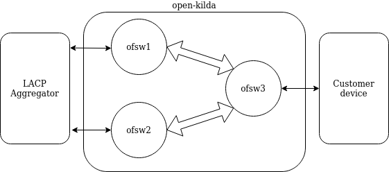
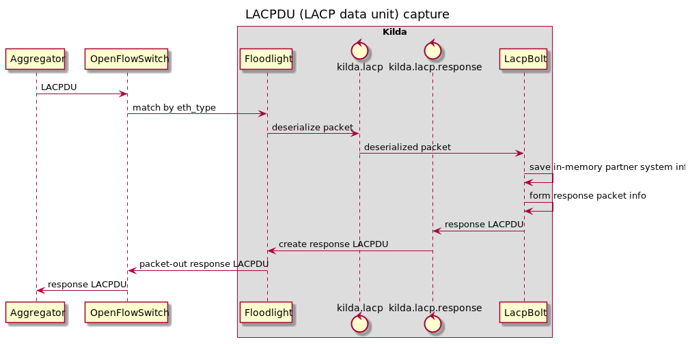

# Link Aggregation Control Protocol

## Description

Link Aggregation allows parallel full duplex point-to-point links to be used as if they were a single link. This design is focused on the following scenario.

  

LACP aggregator is connected to network controlled by open-kilda using one or multiple links (using one or multiple switches). From open-kilda perspective all ports connected to the same LACP aggregator should be treated as aggregateable links. Kilda should be able to:
 * establish LACP session with aggregators
 * create flows terminated on aggregated ports
 
 Traffic from any source endpoint of such flows should be balanced over all destination endpoints which has proper LACP session established.

## LACP session control

Additional default openflow rule is installed on each switch to catch LACP packets and send them to the controller. This rule has match by eth_type=0x8809 (Slow protocols).

Separate storm topology is used to handle all LACP related events. Main part of aggregation topology is the AggregatorBolt. Aggregator bolt should use in-memory storage to save information about partner systems connected to different ports. Storage structure: switch-port tuple is a key and partner system info is a value. Partner system info includes system priority, system, key, port priority, port and state. Two links can be aggregated correctly if they have the same partner system and key but different port. Open-kilda can aggregate any ports so it should respond with constant system and key but different port. Port value should be copied from incoming LACPDU to avoid port collisions on partner side. 

Actor state should be determined in the following way:
* activity = false (passive LACP)
* timeout copied from incoming packet (fast/slow timeout)
* aggregation = true (all endpoints are aggregeteable by kilda)
* syncronization = true if previous packet has the same actor system-key-port and false otherwise
* collecting copied from incoming packet
* distributing copied from incoming packet (kilda ready to send/receive data as soon as partner system is ready)
* defaulted = false (predefined partner system info isn't supported)
* expired = true if no LACPDUs received for a timeout period 

|          | system priority | system | key | port priority | port | state |
| -------- | --------------- | ------ | --- | ------------- | ---- | ----- |
| incoming ||
| actor    | 1 | 11:22:33:44:55:66  | 2 | 3 | 4 | 0x49 |
| partner  | 0 | 00:00:00:00:00:00  | 0 | 0 | 0 | 0x00 |
| outgoing ||
| actor    | const | const MAC  | const | const | 4 | 0x08 |
| partner  | 1 | 11:22:33:44:55:66  | 2 | 3 | 4 | 0x49 |

### API 

New endpoint to get all discovered aggregation links using Northbound `GET /v1/lacp-ports` is provided with response example

~~~
[ 
    {
        "switchId": "00:00:11:22:33:44:55:66",
        "port": 1,
        "partner": {
            "system_priority": 255,
            "system": "22:33:44:55:66:77",
            "key": 1,
            "port_priority": 255,
            "port": 10,
            "state": {
                "activity": true,
                "timeout": "slow",
                "aggregation": true,
                "syncronization": true,
                "collecting": true,
                "distributing": true,
                "defaulted": false,
                "expired": false
            }
        }
    },
...
]
~~~

### Disadvantages

LACP session is established using control plane. If connectivity is lost for a triple LACP timeout (3 seconds for fast and 90 seconds for slow mode) all aggregated links on disconnected switch should be marked as expired and stop transmit/receive data plane traffic.

## Flows with aggregated endpoints